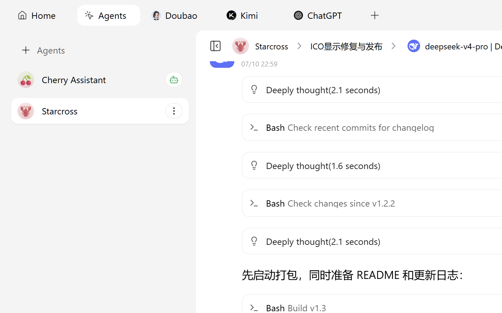

# Word Formatter

<div align="center">

[](https://github.com/DeanChang584/WordFormatter/releases)
[](./LICENSE)
[](https://github.com/DeanChang584/WordFormatter/stargazers)

基于 Python 的 Word 文档批量排版工具，支持 `.doc` / `.docx` 双格式，兼容 Microsoft Office 和 WPS。

</div>

## 界面预览

<div align="center">
  
</div>

## 功能

- **页面设置** — 上下左右页边距（mm）
- **正文样式** — 中英文字体、字号、颜色、加粗/斜体
- **段落设置** — 行距（倍行距/固定值/最小值）、首行缩进、左右缩进、段前段后间距、对齐方式
- **标题样式** — 标题 1~6 级独立设置（字体、字号、颜色、对齐、缩进、行距、段前段后）
- **批量处理** — 选择文件或文件夹，一键处理
- **主题切换** — 浅色 / 深色 / 跟随系统，Apple 风格配色
- **无边框窗口** — 自定义标题栏，原生窗口缩放，现代感十足
- **`.doc` 兼容** — 通过 `win32com` 自动将 `.doc` 转为 `.docx` 后排版
- **安全输出** — 原文件不做修改，输出为 `原文件名-Revise.docx`

## ⭐ Star 趋势

<div align="center">

[](https://star-history.com/#DeanChang584/WordFormatter&Date)

</div>

## 安装与运行

### 环境要求

- **操作系统**：Windows 10 / 11（`.doc` 转换依赖 COM 组件，仅限 Windows）
- **Python**：3.8 及以上
- **Office**（可选）：Microsoft Word 或 WPS（仅处理 `.doc` 文件时需要）

### 1. 克隆仓库

```bash
git clone git@github.com:DeanChang584/WordFormatter.git
cd WordFormatter
```

### 2. 创建虚拟环境（推荐）

```bash
python -m venv venv

# Windows
venv\Scripts\activate
```

### 3. 安装依赖

**完整安装（支持 .doc + .docx）：**

```bash
pip install -r requirements.txt
```

**最小安装（仅 .docx）：**

```bash
pip install python-docx PyQt6
```

> `pywin32` 仅用于将 `.doc` 转为 `.docx`，需要本机安装 Microsoft Word 或 WPS。

### 4. 运行

```bash
python WordFormatter.py
```

### 5. 操作步骤

1. 点击 **选择文件** 或 **选择文件夹** 导入 Word 文档
2. 调节参数：页面边距、段落格式、正文字体、标题样式
3. 点击 **开始排版**，等待进度条完成
4. 排版结果保存为 `原文件名-Revise.docx`，原文件不受影响

### 常见问题

| 问题 | 解决方案 |
|---|---|
| `ImportError: No module named 'PyQt6'` | 运行 `pip install PyQt6` |
| `.doc` 文件提示转换失败 | 确认已安装 `pywin32` 且本机装有 Word 或 WPS |
| `No module named 'docx'` | 运行 `pip install python-docx` |

## 项目结构

```
├── WordFormatter.py         # PyQt6 入口
├── main_window.py           # 主窗口逻辑
├── frameless_window.py      # 无边框窗口基类
├── title_bar.py             # 自定义标题栏组件
├── theme.py                 # 浅色/深色/跟随系统主题
├── engine.py                # 排版引擎（docx 格式化、doc 转换、批量处理）
├── models.py                # 数据模型（FormatProfile, PageConfig 等）
├── worker.py                # QThread 后台工作线程
├── ui/
│   ├── main_window.ui       # Qt Designer 界面布局
│   └── icons/               # 界面图标（SVG）
├── WordFormatter.ico        # 应用图标（5 尺寸）
├── WordFormatter.spec       # PyInstaller 打包配置
├── requirements.txt         # 依赖列表
└── README.md
```

## 架构

```
┌──────────────────────────────────────────┐
│              WordFormatter.py             │
│          PyQt6 入口 / 全局配置            │
└────────────────┬─────────────────────────┘
                 │
    ┌────────────┼────────────┐
    ▼            ▼            ▼
┌───────┐  ┌──────────┐  ┌────────┐
│theme  │  │title_bar │  │frame-  │
│ .py   │  │   .py    │  │less    │
│ 主题  │  │自定义标题│  │窗口基类│
└───────┘  └──────────┘  └────────┘
                 │
    ┌────────────▼────────────┐
    │     main_window.py      │
    │  Qt Designer .ui 加载    │
    └────────┬────────────────┘
             │ signals / slots
    ┌────────▼──────┐   ┌──────────┐
    │   worker.py   │──▶│ engine.py │
    │ QThread 后台  │   │  排版引擎  │
    └───────────────┘   └────┬─────┘
                             │
                      ┌──────▼──────┐
                      │  models.py   │
                      │  数据模型    │
                      └─────────────┘
```

- **WordFormatter.py** — 应用入口，初始化 QApplication、全局字体、窗口图标
- **theme.py** — 主题管理器，支持浅色/深色/跟随系统，基于 Apple Design 配色
- **title_bar.py** — 自定义标题栏，最小化/最大化/关闭按钮，窗口拖动
- **frameless_window.py** — 无边框窗口基类，原生缩放、边缘拖拽调整
- **main_window.py** — 主界面，加载 Qt Designer `.ui`，参数绑定与排版驱动
- **engine.py** — 排版核心，处理 `.docx` 格式化、`.doc` → `.docx` 转换（COM）
- **worker.py** — QThread 后台任务，信号报告进度/状态/结果
- **models.py** — 纯数据层，`FormatProfile` / `PageConfig` / `BodyConfig` 等

## 技术栈

- `PyQt6` — GUI 框架，自定义无边框窗口 + 主题系统
- `python-docx` — `.docx` 读写
- `win32com` — `.doc` 格式转换（调用 Word / WPS COM）
- `PyInstaller` — 打包为独立 exe

## 打包

```bash
pip install pyinstaller
pyinstaller WordFormatter.spec
```

## License

MIT © Dean Chang
