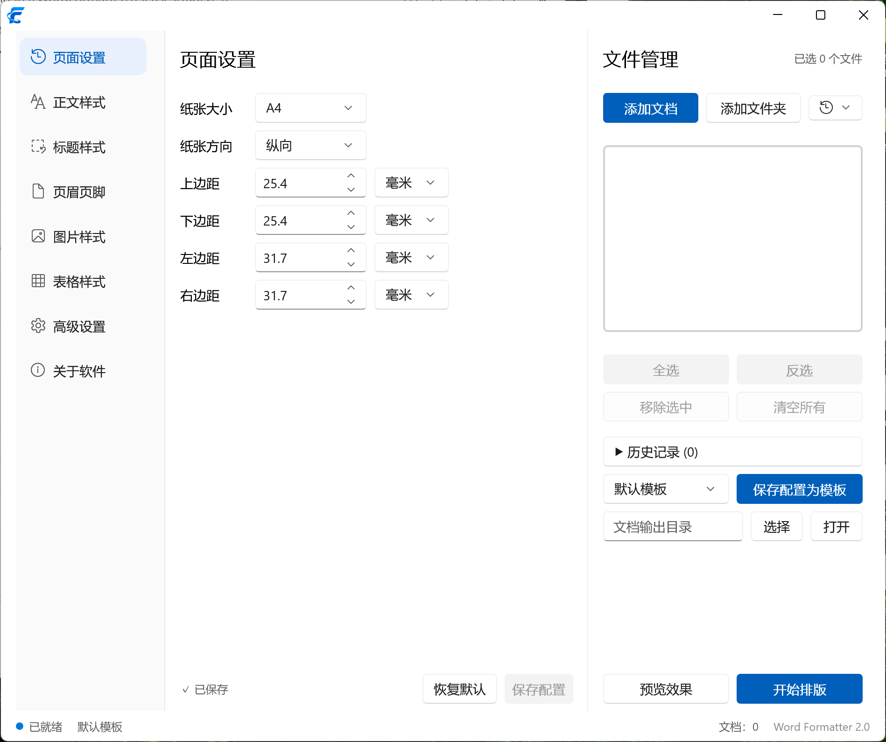
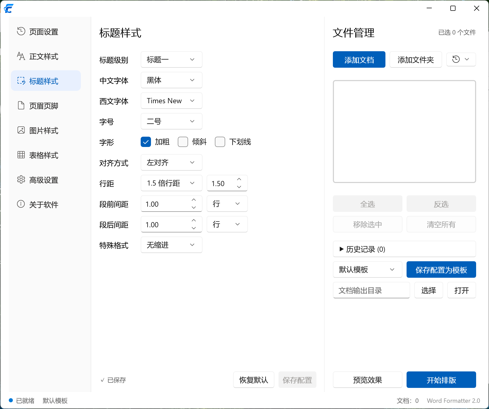
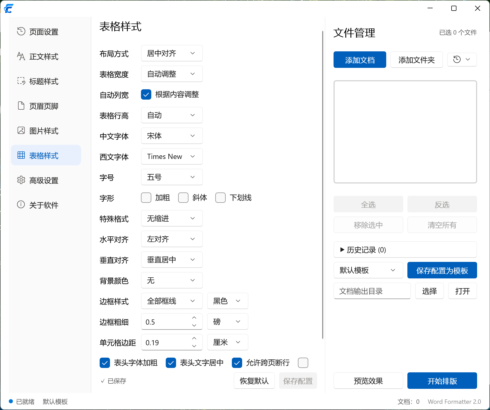
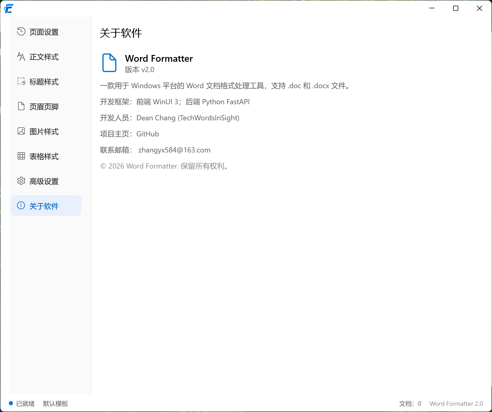

# Word Formatter

WinUI 3 + FastAPI 架构的 Word 文档批量排版工具。支持 `.doc` / `.docx` 双格式，兼容 Microsoft Office 和 WPS，适合批量文档格式规范化需求。

> 最后更新：2026-07-16 | 版本：v2.0 | 平台：Windows 10/11

---

## 界面预览

| 页面设置 | 标题样式 |
|:---:|:---:|
|  |  |

| 表格样式 | 关于软件 |
|:---:|:---:|
|  |  |

---

## 功能

### 排版配置（7 大模块）

| 模块 | 功能 |
|------|------|
| **页面设置** | 纸张大小（A4/A3/B5/Letter/Legal/自定义）、纸张方向（纵向/横向）、页边距（毫米/厘米）、文档网格 |
| **正文样式** | 中/西文字体、字号（初号~小六）、字形（加粗/倾斜/下划线/删除线）、对齐方式、行距（多倍/固定/最小值）、段前段后间距（磅/行）、首行/悬挂缩进（字符/磅/毫米/厘米） |
| **标题样式** | 标题 1~6 级独立配置：中/西文字体、字号、字形、对齐、段间距（行单位）、行距、缩进类型与值 |
| **页眉页脚** | 中/西文字体、字号、字形、对齐、页眉距顶部/页脚距底部距离（毫米/厘米） |
| **图片设置** | 尺寸模式（固定宽度/高度/尺寸/原始）、宽高+单位（厘米/毫米/百分比/像素）、保持纵横比、不放大、对齐方式、文字环绕、压缩质量与自动压缩 |
| **表格设置** | 对齐方式、宽度模式（自动/固定值/百分比）+单位、自适应列宽、行高模式+值+单位、表头字体/字号/加粗/居中/背景色、单元格水平/垂直对齐、边框样式+颜色+宽度、单元格边距+单位、缩进、跨页断行、重复表头 |

### 批量处理

- **文件管理**：添加文件/文件夹、拖拽导入、最近打开、全选/反选、搜索过滤
- **批量排版**：一键启动、后台线程处理、实时进度（文件级）、取消任务、重试失败文件
- **安全输出**：原文件不做修改，输出为 `原文件名-R.docx`，同名自动编号
- **结果统计**：成功/失败计数、失败文件详情与逐文件重试

### 模板系统

- **模板管理**：保存配置为模板、导入/导出模板 JSON、删除（默认模板不可删除）
- **默认模板**：预置"默认模板"，首次启动自动创建
- **运行时存储**：所有用户数据（模板、日志、设置、历史）存储在 `%LOCALAPPDATA%\WordFormatter\`，不受安装目录权限限制

### 预览

- **文档预览**：通过 WPS/Word COM 将格式化后的 DOCX 转为 PDF，使用 WebView2 + PDF.js 渲染，支持缩放（100%/适应宽度/适应页面）、翻页

---

## 快速开始

### 方式一：安装包（推荐）

从 [Releases](https://github.com/DeanChang584/WordFormatter/releases) 下载最新 `Word Formatter v2.0.exe`，双击安装即可。安装后双击桌面快捷方式启动。

**系统要求**：
- Windows 10/11（x64）
- [WebView2 Runtime](https://developer.microsoft.com/en-us/microsoft-edge/webview2/)（Win11 自带）
- Microsoft Word 或 WPS Office（预览功能可选）
- 无需安装 .NET SDK 或 Python

### 方式二：源码运行（开发）

```bash
# 1. 后端
cd WordFormatter
pip install -r requirements.txt
python -m uvicorn backend.server:app --host 127.0.0.1 --port 8765

# 2. 前端（新终端）
cd WordFormatter/frontend
dotnet run

# 或直接双击 run.bat
```

---

## 项目结构

```
WordFormatter/
├── frontend/                     # WinUI 3 前端 (.NET 9)
│   ├── App.xaml / App.xaml.cs    # 应用入口 + 后端健康检测 + WPS/WebView2 预热
│   ├── MainWindow.xaml(.cs)      # 主窗口（三栏自适应布局）
│   ├── Views/                    # 页面视图（12 个）
│   │   ├── PageSettingsView      # 页面设置
│   │   ├── BodyStyleView         # 正文样式
│   │   ├── HeadingStyleView      # 标题样式
│   │   ├── HeaderFooterView      # 页眉页脚
│   │   ├── PictureSettingsView   # 图片设置（完整实现）
│   │   ├── TableSettingsView     # 表格设置（完整实现）
│   │   ├── AdvancedSettingsView  # 高级设置
│   │   ├── AboutView             # 关于软件
│   │   ├── PreviewWindow         # PDF 预览窗口（WebView2 + PDF.js）
│   │   ├── FormatControlView     # 排版控制卡片
│   │   ├── ResultHistoryView     # 结果与历史卡片
│   │   └── TemplateManagementView# 模板管理
│   ├── ViewModels/               # MVVM ViewModel（13 个）
│   │   ├── MainViewModel         # 统一 DataContext + SharedProfile
│   │   ├── PageSettingsVm ~ TableSettingsVm  # 6 个 section VM
│   │   ├── FormatViewModel       # 排版控制 + 模板加载
│   │   ├── TemplateManagementVm  # 模板管理
│   │   └── ...                   # Files, History, Settings 等
│   ├── Controls/                 # 自定义控件（7 个）
│   │   ├── TitleBar / NavBar / ItemSelector  # 标题栏 + 导航栏
│   │   ├── StatusBar / ConfigCard            # 状态栏 + 配置卡片
│   │   └── NumericTextBox                    # 数字输入控件
│   ├── Services/                 # 前端服务
│   │   ├── ApiService.cs         # HTTP 客户端（18 个 API 方法）
│   │   ├── DocumentPreviewService # PDF 预览策略（WPS/Word COM）
│   │   ├── WpsPdfConverter       # WPS COM 转换器
│   │   ├── WordPdfConverter      # Word COM 转换器
│   │   └── ThemeService / TrayIconService / FontSizeConverter
│   ├── Models/                   # DTO 定义（7 个子目录，22 个文件）
│   ├── Styles/LightTheme.xaml    # 浅色主题（Office 专业风格）
│   ├── Assets/pdfjs/             # PDF.js 渲染引擎
│   ├── Launcher/                 # C# 启动器（替代 bat）
│   └── TrimmerRoots.xml          # .NET 裁剪保留规则
│
├── backend/                      # FastAPI 后端 (Python)
│   ├── server.py                 # 入口 + CORS + 7 个路由注册
│   ├── api/                      # API 路由层（8 个文件）
│   │   ├── health / files / profile / templates / format
│   │   └── history / preview
│   ├── services/                 # 业务服务层
│   │   ├── file_service.py       # 文件管理
│   │   ├── format_service.py     # 排版任务调度
│   │   └── template_service.py   # 模板 CRUD
│   ├── formatter/                # 排版引擎（8 个模块）
│   │   ├── engine.py             # 排版主控（7 步编排）
│   │   ├── page.py               # 页面规则（含页眉页脚字体）
│   │   ├── paragraph.py          # 段落规则（行距/缩进/多单位）
│   │   ├── heading.py            # 标题规则（1-6 级）
│   │   ├── image.py              # 图片规则（尺寸/环绕/对齐/压缩）
│   │   ├── table.py              # 表格规则（600+ 行完整实现）
│   │   ├── header_footer.py      # 页眉页脚（遍历所有 section）
│   │   └── font.py               # 字体工具
│   ├── history/manager.py        # 历史记录持久化
│   ├── preview/generator.py      # 预览文本生成
│   ├── config/manager.py         # 设置管理
│   └── utils/                    # 工具模块
│       ├── app_paths.py          # 数据目录路径（%LOCALAPPDATA%）
│       ├── logger.py             # 日志（按分类分文件 + 按日期归档）
│       └── response.py           # 统一响应格式
│
├── shared/                       # 前后端共享契约
│   ├── schemas.py                # 17 个 Pydantic DTO
│   ├── constants.py              # 常量（字号/纸张/错误码）
│   └── version.py                # VERSION = "2.0"
│
├── memory-bank/                  # 项目设计文档（8 个文件）
├── screenshots/                  # 界面截图
├── tests/                        # 测试（66 passed, 3 skipped）
│   ├── test_api.py               # API 集成测试
│   ├── test_integration_flow.py  # 端到端流程测试
│   └── test_paragraph_indent.py  # 段落缩进专项测试
│
├── requirements.txt              # Python 依赖
├── run.bat                       # 开发一键启动
└── WordFormatter.sln
```

---

## 技术栈

| 层 | 技术 | 用途 |
|----|------|------|
| 前端 | WinUI 3 / .NET 9 / C# 13 | Windows 原生界面 |
| 前端 | CommunityToolkit.Mvvm 8.4 | MVVM 源代码生成 |
| 前端 | WebView2 + PDF.js 4.x | PDF 预览渲染 |
| 后端 | Python 3.14 + FastAPI | REST API |
| 后端 | python-docx | Word 排版引擎 |
| 后端 | Pillow | 图片压缩 |
| 后端 | PyInstaller 6.21 | 后端打包为独立 EXE |
| 通信 | HTTP REST + JSON (camelCase) | 127.0.0.1:8765 |
| 打包 | Inno Setup 6 | 安装包制作 |

---

## 数据存储

所有运行时数据存储在用户目录下，不受安装目录（Program Files）权限限制：

```
%LOCALAPPDATA%\WordFormatter\
├── templates\        # 模板文件（.json）
├── history\          # 历史记录（.json）
├── logs\             # 运行日志（按用途分文件 + 按日期归档）
├── preview\          # PDF 预览缓存
└── settings.json     # 软件设置
```

日志分类：`app.log`（前端）、`backend.log`（API/Service）、`format.log`（排版任务）、`error.log`（异常汇总）。每日午夜自动归档，保留 30+90 天。

---

## 更新日志

详见 [CHANGELOG.md](CHANGELOG.md)。

---

## License

MIT
